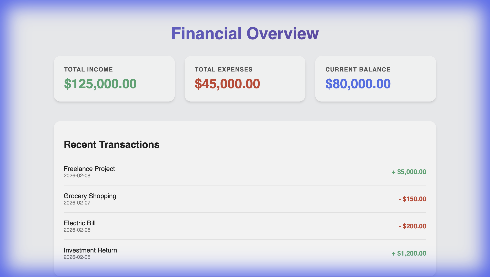

# Personal Finance Tracker Walkthrough

## Overview
This document outlines the verification of the Personal Finance Tracker application, which connects a React frontend to a Node.js backend.

## Verification Steps

### 1. Backend API
- **Action**: Start the backend server on port 5001.
- **Verification**: The server starts successfully and listens for requests.
- **Endpoint**: `GET http://localhost:5001/api/dashboard` returns the expected JSON data.

### 2. Frontend Dashboard
- **Action**: Start the React application on port 5173.
- **Verification**: The application loads without errors.
- **Loading State**: A "Loading Dashboard..." message appears initially.
- **Data Display**: After a short delay, the dashboard displays:
    - Total Income: $125,000.00
    - Total Expenses: $45,000.00
    - Balance: $80,000.00
    - Recent Transactions list

### 3. Screenshots
<!-- carousel -->

<!-- slide -->
